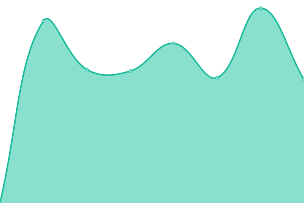
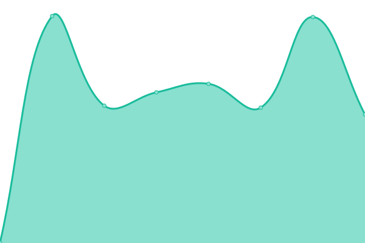
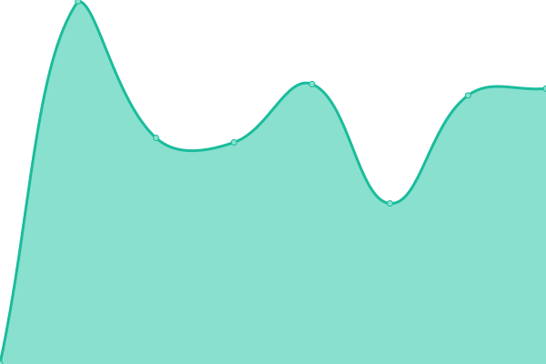
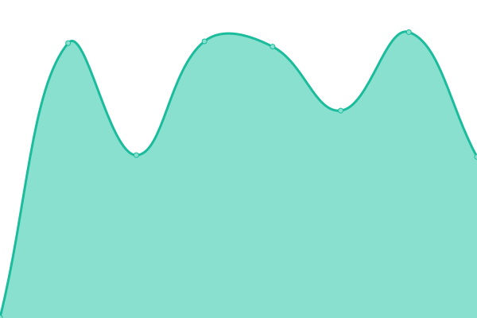
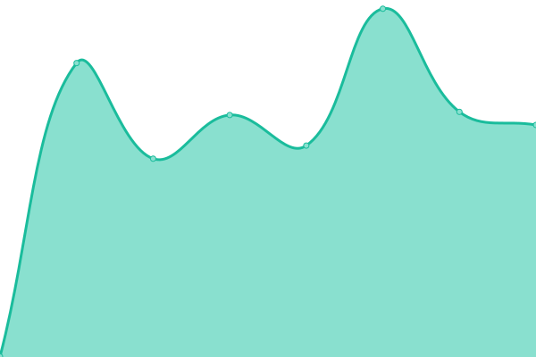
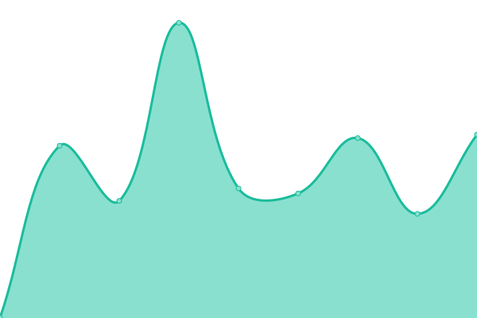

# [📈 Live Status](https://tinawng.github.io/Upptime): <!--live status--> **🟧 Partial outage**

This repository contains the open-source uptime monitor and status page for [Tina Wang](tina.cafe), powered by [Upptime](https://github.com/upptime/upptime).

With [Upptime](https://upptime.js.org), you can get your own unlimited and free uptime monitor and status page, powered entirely by a GitHub repository. We use [Issues](https://github.com/tinawng/Upptime/issues) as incident reports, [Actions](https://github.com/tinawng/Upptime/actions) as uptime monitors, and [Pages](https://tinawng.github.io/Upptime) for the status page.

<!--start: status pages-->
<!-- This summary is generated by Upptime (https://github.com/upptime/upptime) -->
<!-- Do not edit this manually, your changes will be overwritten -->
<!-- prettier-ignore -->
| URL | Status | History | Response Time | Uptime |
| --- | ------ | ------- | ------------- | ------ |
|  ⛩️ Torii | 🟩 Up | [torii.yml](https://github.com/tinawng/upptime/commits/HEAD/history/torii.yml) | 

 787ms
     
 | 

<a href="https://tinawng.github.io/Upptime/history/torii">99.83%</a>
    

|  [Merge](https://merge.tina.cafe/) | 🟩 Up | [merge.yml](https://github.com/tinawng/upptime/commits/HEAD/history/merge.yml) | 

 701ms
     
 | 

<a href="https://tinawng.github.io/Upptime/history/merge">99.83%</a>
    

|  [Mellow](https://mellow.tina.cafe/) | 🟩 Up | [mellow.yml](https://github.com/tinawng/upptime/commits/HEAD/history/mellow.yml) | 

 974ms
     
 | 

<a href="https://tinawng.github.io/Upptime/history/mellow">99.83%</a>
    

|  [Gallery](https://gallery.tina.cafe/) | 🟩 Up | [gallery.yml](https://github.com/tinawng/upptime/commits/HEAD/history/gallery.yml) | 

 642ms
     
 | 

<a href="https://tinawng.github.io/Upptime/history/gallery">99.83%</a>
    

|  [🎋 Tanabata](https://tanabata.tina.cafe/ping) | 🟩 Up | [tanabata.yml](https://github.com/tinawng/upptime/commits/HEAD/history/tanabata.yml) | 

 654ms
     
 | 

<a href="https://tinawng.github.io/Upptime/history/tanabata">99.83%</a>
    

|  🗃️ Mellow Pocketbase | 🟩 Up | [mellow-pocketbase.yml](https://github.com/tinawng/upptime/commits/HEAD/history/mellow-pocketbase.yml) | 

 743ms
     
 | 

<a href="https://tinawng.github.io/Upptime/history/mellow-pocketbase">99.83%</a>
    

|  🗃️ Logs Pocketbase | 🟥 Down | [logs-pocketbase.yml](https://github.com/tinawng/upptime/commits/HEAD/history/logs-pocketbase.yml) | 

 3598ms
     
 | 

<a href="https://tinawng.github.io/Upptime/history/logs-pocketbase">0.00%</a>
    

|  [Hello](https://www.tina.cafe/) | 🟩 Up | [hello.yml](https://github.com/tinawng/upptime/commits/HEAD/history/hello.yml) | 

 538ms
     
 | 

<a href="https://tinawng.github.io/Upptime/history/hello">99.83%</a>
    

|  [Blog](https://blog.tina.cafe/) | 🟥 Down | [blog.yml](https://github.com/tinawng/upptime/commits/HEAD/history/blog.yml) | 

 3565ms
     
 | 

<a href="https://tinawng.github.io/Upptime/history/blog">0.00%</a>
    

|  [Chill](https://chill.tina.cafe/) | 🟥 Down | [chill.yml](https://github.com/tinawng/upptime/commits/HEAD/history/chill.yml) | 

 3666ms
     
 | 

<a href="https://tinawng.github.io/Upptime/history/chill">0.00%</a>
    

|  [Nexon](https://nexon.tina.cafe/) | 🟥 Down | [nexon.yml](https://github.com/tinawng/upptime/commits/HEAD/history/nexon.yml) | 

 3568ms
     
 | 

<a href="https://tinawng.github.io/Upptime/history/nexon">0.00%</a>
    

|  [Baseliner](https://baseliner.tina.cafe/) | 🟥 Down | [baseliner.yml](https://github.com/tinawng/upptime/commits/HEAD/history/baseliner.yml) | 

 3643ms
     
 | 

<a href="https://tinawng.github.io/Upptime/history/baseliner">0.00%</a>
    

|  [WatchAshFly](https://watchashfly.tina.cafe/) | 🟥 Down | [watch-ash-fly.yml](https://github.com/tinawng/upptime/commits/HEAD/history/watch-ash-fly.yml) | 

 3548ms
     
 | 

<a href="https://tinawng.github.io/Upptime/history/watch-ash-fly">0.00%</a>
    

|  [Portal](https://portal.tina.cafe/) | 🟥 Down | [portal.yml](https://github.com/tinawng/upptime/commits/HEAD/history/portal.yml) | 

 3591ms
     
 | 

<a href="https://tinawng.github.io/Upptime/history/portal">0.00%</a>
    

|  [Capture](https://capture.tina.cafe/) | 🟥 Down | [capture.yml](https://github.com/tinawng/upptime/commits/HEAD/history/capture.yml) | 

 3583ms
     
 | 

<a href="https://tinawng.github.io/Upptime/history/capture">0.00%</a>
    

|  [Place](https://place.tina.cafe/) | 🟥 Down | [place.yml](https://github.com/tinawng/upptime/commits/HEAD/history/place.yml) | 

 3514ms
     
 | 

<a href="https://tinawng.github.io/Upptime/history/place">0.00%</a>
    

<!--end: status pages-->

[**Visit our status website →**](https://tinawng.github.io/Upptime)

## 📄 License

- Powered by: [Upptime](https://github.com/upptime/upptime)
- Code: [MIT](./LICENSE) © [Tina Wang](tina.cafe)
- Data in the `./history` directory: [Open Database License](https://opendatacommons.org/licenses/odbl/1-0/)
